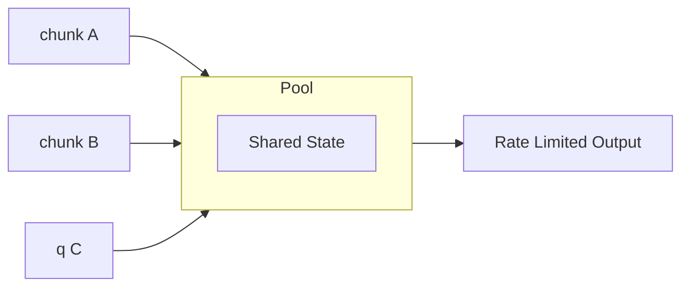

<div align="center">
  
  <h1>chunked-promise</h1>
  <p>Chunked async execution. No deps.</p>
</div>

## Install

```bash
npm install chunked-promise
```

## Usage

```javascript
import { q, chunk } from 'chunked-promise'

const tasks = urls.map(url => () => fetch(url))

await q(tasks)        // sequential: 1 → 2 → 3
await chunk(tasks, 3) // batched: [1,2,3] → [4,5,6]
```

## API

### `q(fns, opts?)`

Queue execution - one at a time.

```javascript
await q([
  () => fetch('/api/1'),
  () => fetch('/api/2'),
  () => fetch('/api/3')
])
```

### `chunk(fns, n = 5, opts?)`

Chunk execution - n at a time.

```javascript
await chunk([
  () => fetch('/api/1'),
  () => fetch('/api/2'),
  () => fetch('/api/3'),
  () => fetch('/api/4')
], 2)  // [1,2] → [3,4]
```

### `createPool(opts?)`

Create a pool with shared state. Returns `{ chunk, q }` bound to shared rate limiter.

```javascript
const pool = createPool({ rateLimit: 10 })

// pool.chunk and pool.q share the same rate limit
await pool.chunk(tasks, 5)
await pool.q(moreTasks)
```

### Options

Both functions accept an options object:

| Option | Type | Description |
|--------|------|-------------|
| `onProgress` | `function` | Called after each task with `{ done, total, results }` |
| `signal` | `AbortSignal` | Cancel execution via AbortController |
| `timeout` | `number` | Per-task timeout in milliseconds |
| `rateLimit` | `number` | Max tasks per second (0 = unlimited) |

### Results (Settled Mode)

Results use settled mode (like `Promise.allSettled`):

```javascript
const results = await chunk(tasks, 4)

// [
//   { status: 'fulfilled', value: result },
//   { status: 'rejected', reason: error },
// ]

// Filter successes
const values = results
  .filter(r => r.status === 'fulfilled')
  .map(r => r.value)

// Filter failures
const errors = results
  .filter(r => r.status === 'rejected')
  .map(r => r.reason)
```

### Progress Callback

```javascript
await chunk(tasks, 4, {
  onProgress: ({ done, total, results }) => {
    console.log(`${done}/${total} complete`)
    const pct = Math.round((done / total) * 100)
    progressBar.style.width = `${pct}%`
  }
})
```

### Cancellation

```javascript
import { chunk, AbortError } from 'chunked-promise'

const controller = new AbortController()

// Cancel after 5 seconds
setTimeout(() => controller.abort(), 5000)

try {
  await chunk(tasks, 4, { signal: controller.signal })
} catch (e) {
  if (e instanceof AbortError) {
    console.log('Cancelled!')
  }
}
```

### Timeout

```javascript
import { chunk, TimeoutError } from 'chunked-promise'

const results = await chunk(tasks, 4, { timeout: 3000 })

// Check for timeouts
results.forEach((r, i) => {
  if (r.status === 'rejected' && r.reason instanceof TimeoutError) {
    console.log(`Task ${i} timed out`)
  }
})
```

### Rate Limiting

```javascript
// Max 10 requests per second
await chunk(apiCalls, 4, { rateLimit: 10 })
```

### Pool (Global Rate Limiting)



Without a pool, each call has its own rate limiter:

```javascript
// BAD: Each gets 10/s = 20 req/s total (may exceed API limits)
await Promise.all([
  chunk(tasksA, 5, { rateLimit: 10 }),
  chunk(tasksB, 5, { rateLimit: 10 })
])
```

Use `createPool` to share a single rate limiter across concurrent calls:

```javascript
// GOOD: Combined 10/s total
const pool = createPool({ rateLimit: 10 })

await Promise.all([
  pool.chunk(tasksA, 5),
  pool.chunk(tasksB, 5)
])
```

Pool options are inherited by all calls. Per-call options can override (except shared state).

### Combined Example

```javascript
import { chunk, AbortError, TimeoutError } from 'chunked-promise'

const controller = new AbortController()

const results = await chunk(tasks, 4, {
  signal: controller.signal,
  timeout: 5000,
  rateLimit: 10,
  onProgress: ({ done, total }) => {
    console.log(`Progress: ${done}/${total}`)
  }
})

const succeeded = results.filter(r => r.status === 'fulfilled').length
const failed = results.filter(r => r.status === 'rejected').length
console.log(`Done: ${succeeded} succeeded, ${failed} failed`)
```

## Exports

```javascript
import { 
  q,            // Queue execution (sequential)
  chunk,        // Chunk execution (parallel batches)
  createPool,   // Shared rate limiting pool
  AbortError,   // Thrown on cancellation
  TimeoutError  // Thrown on timeout
} from 'chunked-promise'
```

## Demo

```bash
pnpm dev
```

## License

MIT
